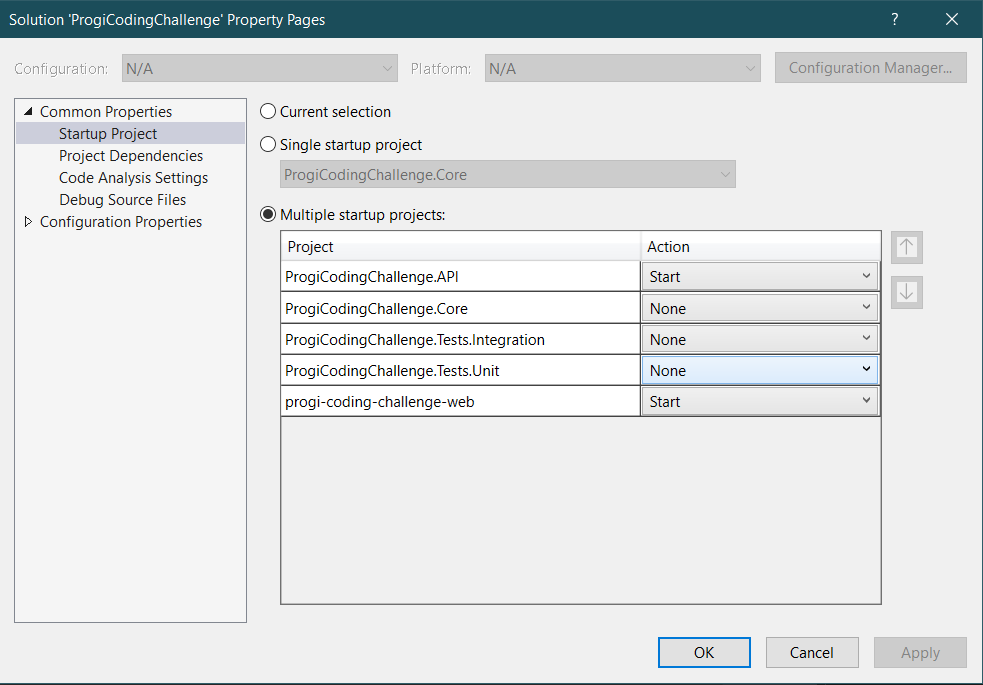

# ProgiCodingChallenge

## How to Run the Application

Follow the steps below to run the application correctly:

### Prerequisites
- Visual Studio installed on your machine.

### Configuration Steps
1. Open the `ProgiCodingChallenge` solution in Visual Studio.
2. Right-click on the solution and select **Properties**.
3. In the left-hand menu, click on **Startup Project**.
4. Select the option **Multiple startup projects**.
5. Set the action for the following projects:
   - `ProgiCodingChallenge.API`: **Start**
   - `progi-coding-challenge-web`: **Start**
6. Click **OK** to save the changes.

### Example Configuration
Below is an example of how the configuration should look:



Now, you can run the application by pressing **F5** or clicking **Start** in Visual Studio.

---

### Additional Notes
- Make sure to install **Axios** globally if needed by running:

```bash
npm install -g axios
